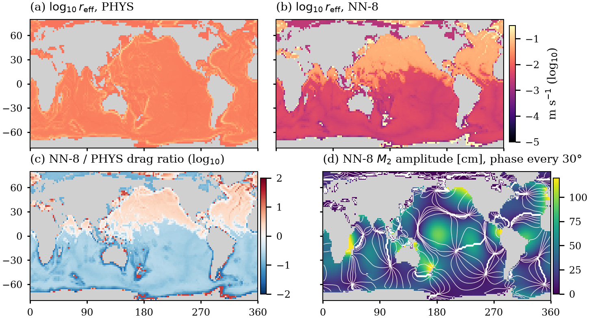
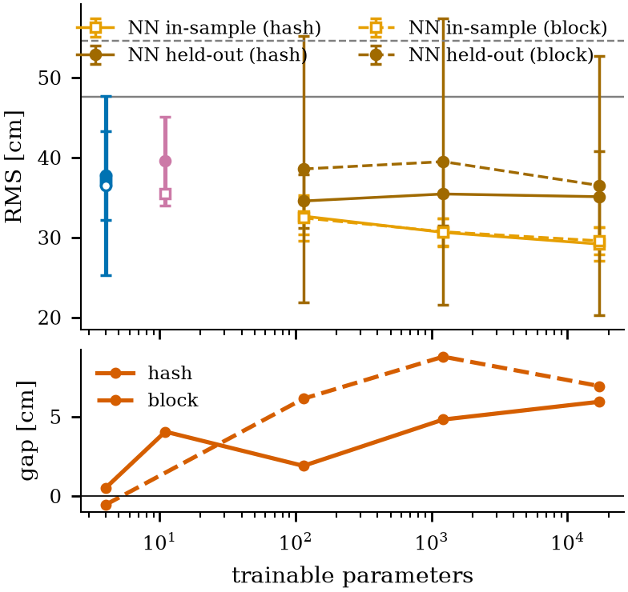
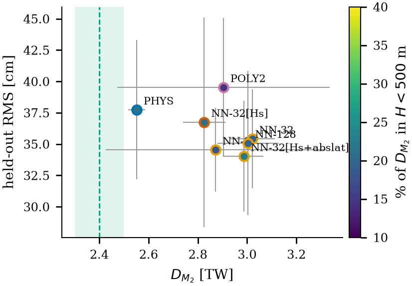
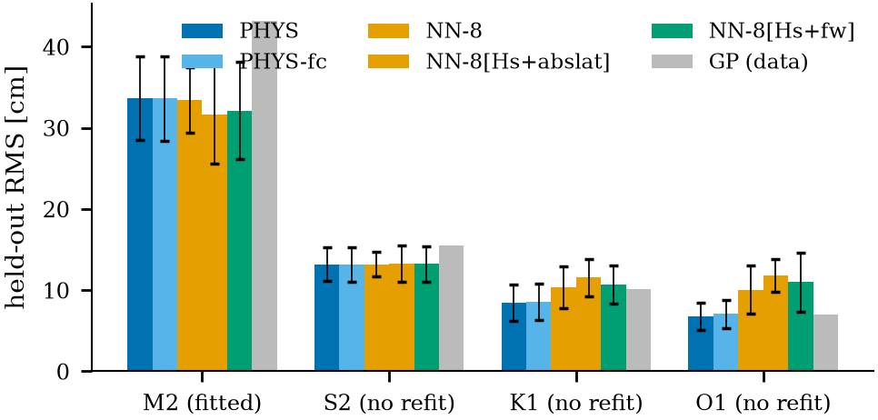
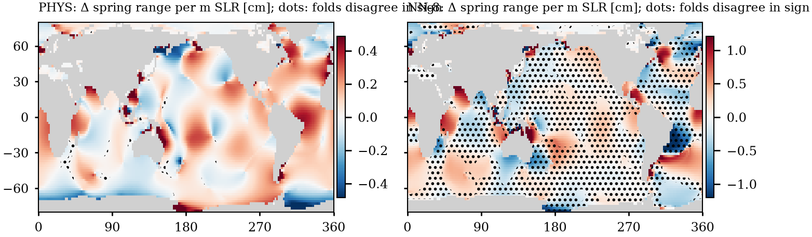

pinn_tides

<b>Physics-informed neural closures for global barotropic tides.</b> 

Differentiable tide equations, sparse LU solves, implicit adjoints, learnable dissipation, and reproducible experiments.

Authors
Author	Affiliation
Author 1	HKUST
Author 2	Trent University, Canada
What this is
pinn_tides is a compact research codebase for learning effective tidal dissipation in a global barotropic tide model.

It solves the frequency-domain linearised Laplace tidal equations on a latitude-longitude Arakawa C-grid with:

exact sparse PDE solves per tidal constituent
positive learnable drag field
scalar self-attraction/loading factor
implicit-function adjoint gradients
energy-budget checks
tide-gauge cross-validation
publication figures and LaTeX tables
Repository layout
basic
.
├── tide.py              # Core differentiable tide solver and CLI
├── experiments.py       # Experiment suite and figure/table generation
├── requirements.txt     # Python dependencies
├── figs/                # Generated figures and .dat files
├── cache/               # Downloaded data cache, created locally
├── results/             # Fit results, created locally
└── tables/              # Generated LaTeX tables, created locally

Quick start
basic
git clone https://github.com/BorisKriuk/pinn_tides.git
cd pinn_tides

python -m venv .venv
source .venv/bin/activate

pip install -r requirements.txt

Run a fast synthetic check:

smali
python tide.py check --synthetic --closure phys
python tide.py check --synthetic --closure nn:8

Core commands
1. Check physics and gradients
smali
python tide.py check --closure phys
python tide.py check --closure nn:8

This verifies:

energy identity
sparse solver residual
implicit adjoint gradient against finite differences
2. Fit a model
python tide.py fit --closure nn:8 --fold 0 --scheme hash

Example with explicit options:

apache
python tide.py fit \
  --closure nn:32:2:H+slope \
  --constituents M2,S2,K1,O1 \
  --res 2 \
  --year 2018 \
  --max-gauges 250 \
  --iters 60

The fitted parameters are saved to:

results/params.json

3. Evaluate
python tide.py eval

Reports held-out RMS skill against:

learned PDE model
Gaussian-process gauge baseline
nearest-gauge baseline
equilibrium tide baseline
4. Predict a tide series
apache
python tide.py predict \
  --lat 21.3 \
  --lon 202.1 \
  --start 2024-06-01T00:00 \
  --hours 240

Output:

results/predict_<lat>_<lon>.csv

Closure options
Closure	Meaning
phys	Four-parameter physical drag law
physfc	Physical drag with critical-latitude cutoff
nn:8	Neural closure with width 8
nn:32	Neural closure with width 32
nn:32:2:H+slope	NN using selected features
nn:8:2:H+slope+fw	Frequency-aware NN closure
poly:2	Polynomial closure
poly:3:H+slope+lat	Polynomial closure with custom features
Available features:

H, slope, lat, abslat, fw

Run experiments
Fast smoke test:

python experiments.py all --quick --skip-res

Full suite:

python experiments.py all

Individual experiments:

vim
python experiments.py check
python experiments.py cv
python experiments.py block
python experiments.py reg
python experiments.py transfer
python experiments.py energy
python experiments.py distill
python experiments.py slr
python experiments.py res
python experiments.py figures

Experiment guide
Command	Experiment
check	Energy identity and adjoint gradient check
cv	Five-fold hash cross-validation
block	Spatial-block cross-validation
reg	Regularisation and NN-width sweep
transfer	Fit M2, predict S2, K1, O1
energy	Energy-constrained Pareto study
distill	Distil NN drag into polynomial laws
slr	Spring-range sensitivity to sea-level rise
res	Resolution comparison
figures	Regenerate figures and LaTeX tables
Example figures

Outputs
After fitting and experiments:

results/
├── params.json
├── eval.json
├── runs/
├── fields/
└── summary_*.json

Generated figures:

figs/
├── fig_capacity.pdf
├── fig_maps.pdf
├── fig_skill_energy.pdf
├── fig_transfer.pdf
├── fig_slr.pdf
└── ...

Generated LaTeX tables:

tables/
└── *.tex

Data
The workflow downloads public/open data and caches it locally.

Typical cache location:

cache/

No API key is needed for the core workflow.

Minimal reproducible workflow
smali
python tide.py check --synthetic --closure phys
python tide.py check --synthetic --closure nn:8

python experiments.py all --quick --skip-res
python experiments.py figures

License
Code: MIT License.

Data: subject to original provider terms.

Suggested citation
If this repository helps your work, please cite the project and acknowledge the public tide-gauge, bathymetry, and geophysical data providers used by the workflow.
